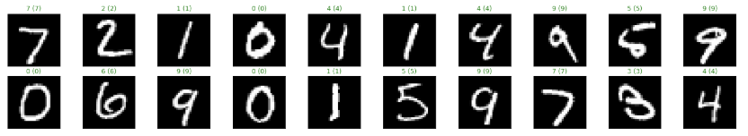

# Recognizing Hand-written Numbers Using a Pytorch Neural Network

### Overview

A neural network trained to recognized handwritten numbers. This was built using [PyTorch](https://pytorch.org/), and trained on the [MNIST handwritten digit database](http://yann.lecun.com/exdb/mnist/).

### Jupyter Notebook

See the Jupyter notebook here: [mnist_mlp_handwriting_exercise.ipynb](mnist_mlp_handwriting_exercise.ipynb).

### Results

This network achieved a test accuracy of 98%.

### References

This exercise was part of the [Udacity Deep Learning / ML nanodegree](https://www.udacity.com/course/deep-learning-nanodegree--nd101).
